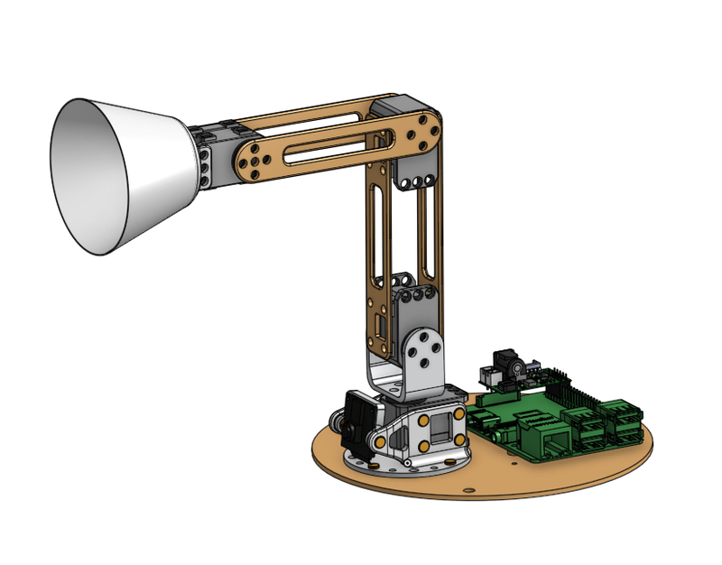

# Poppy Ergo Starter

Poppy Ergo Starter robot is a small and low cost 4-degree-of-freedom robot arm. It consists of very simple shapes which can be easily 3D printed with FDM printers and laser cutted.

It works with Dynamixel XL-320 motors, and a Raspberry Pi for control.

It comes with three tools:
* a lampshade
* a graspper
* a pen holder

The Ergo Poppy Starter is ideal to start manipulating robots and learn robotic without difficulties.

It is particularly well suited for educational purposes (cheap, simple to assemble, and easily controllable) or can be a very nice desk decoration for geeks and makers...

## Contributing

You can share your experience, new design, ideas or questions on the [Poppy project forum](https://forum.poppy-project.org/).

To contribute to this repository, you can [fork it](https://help.github.com/articles/fork-a-repo/) and propose a [pull request](https://help.github.com/articles/using-pull-requests/) *([Another useful link](https://gun.io/blog/how-to-github-fork-branch-and-pull-request/))*

## License

All the technological development work made in the Poppy project is freely available under open source licenses. Only the name usage *"Poppy"* is restricted and protected as an international trademark, please contact us if you want to use it or have more information.

|   License     |     Hardware    |   Software      |
| ------------- | :-------------: | :-------------: |
| Title  | [Creative Commons BY-SA](http://creativecommons.org/licenses/by-sa/4.0/)  |[GPL v3](http://www.gnu.org/licenses/gpl.html)  |
| Logo  |   |  |

## The Poppy project history

The Poppy project is born in 2012 in the [Flowers laboratory](https://flowers.inria.fr/) at [Inria Bordeaux Sud-Ouest](http://www.inria.fr/en/centre/bordeaux).
It was initiated during [Matthieu Lapeyre](https://github.com/matthieu-lapeyre)'s PhD Thesis surpervised by [Pierre Yves Oudeyer](http://www.pyoudeyer.com/). At the beginning, the development team was composed by [Matthieu Lapeyre](https://github.com/matthieu-lapeyre) (mechanics & design), [Pierre Rouanet](https://github.com/pierre-rouanet) (software) and [Jonathan Grizou](http://jgrizou.com/) (electronics).

This project is initially a fundamental research project financed by [ERC Grant Explorer](http://erc.europa.eu/) to explore the role of embodiement and morphology properties on cognition and especially on the learning of sensori-motor tasks.

## More on the project

- [Website](https://www.poppy-project.org)
- [Forum](https://forum.poppy-project.org)
- [Youtube](https://www.youtube.com/channel/UC3iVGSr-vMgnFlIfPBH2p7Q)
- [Twitter](https://twitter.com/poppy_project)
- [Flickr](https://www.flickr.com/photos/poppy-project)
- [Vimeo](https://vimeo.com/poppyproject)
- [Thingiverse](http://www.thingiverse.com/poppy_project/)
