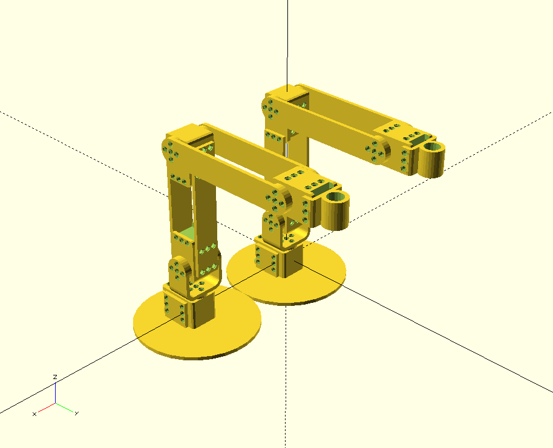

# poppy-4dof-arm-mini

These robot are exactly the same size as the [poppy-ergo-jr](https://github.com/poppy-project/poppy-ergo-jr).

[BOM >>](hardware/parts/BOM.md)

Stl files for the parts are joined with the last release: https://github.com/poppy-project/poppy-4dof-arm-mini/releases/tag/beta1
